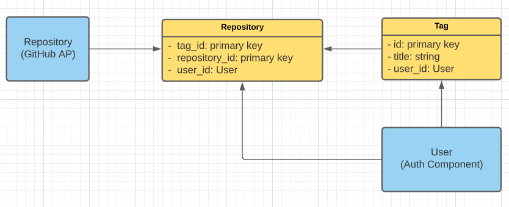
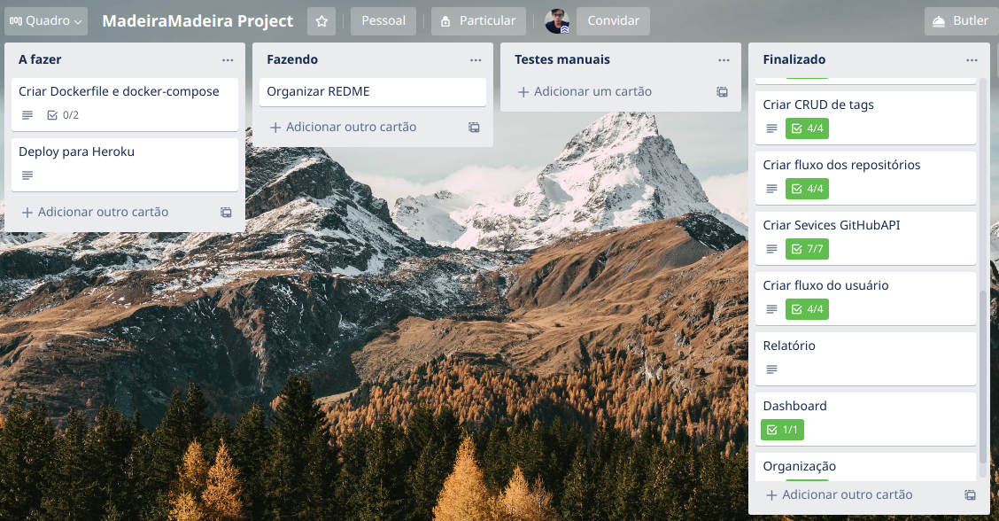

# Tagging-Repository

Tagging-Repository permite criar Tags e associa-las a Repositórios que vem diretamente do GitHub.


### Como Installar

Execute o `composer install` para instalar as dependências que a aplicação utiliza. Caso não possua o composer utilize estas [instruções](https://getcomposer.org/download/) para instalar.

Excutando `composer install`

```
  composer install    
```

Gerar `token` para utilizar a API do GitHub você precisará de um token para autenticação, acesse este [link](https://developer.github.com/v3/auth/#via-oauth-and-personal-access-tokens) para receber as instruções. Com o token em mãos basta ir no ser arquivo `.env` e alterar a variavel de ambiente.

```
  GIT_HUB_API_TOKEN=meu_token_gerado_no_git_hub    
```

Após instalar as dependências crie o seu banco de dados, **atualmente a App está configurada para utilizar o banco de dados MySQL**, mas caso queria alterar basta ir no seu arquivo `.env` e alterar as variaveis de ambiente de conexão com banco de dados.

Para gerar a estrutura de tabelas do seu banco de dados basta excutar o seguinte comando para que as migrations sejam executadas (para saber mais sobre migrations acesse este [link](https://laravel.com/docs/8.x/migrations).):

```
  php artisan migrate    
```

## Como executar os testes

Execute este comando:

```
  php artisan test    
```

**Outputs esperados**

 
 

**Observação:** Os tests que dependem da camada Services estão quebrando, porém a funcionalidade da camada Services está 100%, o motivo dos testes estarem quebrando é que o pacote php-vcr não esta conseguindo grava os VCRs de uma forma que HttpClient do Laravel entenda, busquei durante muito tempo na internet e infelizmente não encontrei solução, o mais próximo que cheguei [foi neste ponto](https://github.com/php-vcr/php-vcr/issues/309). Diante dessa situação a minha tomada de decisão foi manter os tests quebrados e procurar uma solução futuramente ao invés de remove o HttpClient do Laravel e utilizar a biblioteca CURL do PHP. Caso fique alguma dúvida a respeito da funcionalidade dos Services, basta remover a opção de gravar VCR dos metodos testados e verá que tudo passa normamelnte, porém deixar os tests sem o VCR não é uma boa prática.


### Dependências

Tagging-Repository depende de:

* PHP >= 7.3
* [Dependências do Laravel](https://laravel.com/docs/8.x)

## Bibliotecas utilizadas

PHP:

* Laravel/ui
* guzzlehttp/guzzle
* lucascudo/laravel-pt-br-localization
* felixkiss/uniquewith-validator
* php-vcr/phpunit-testlistener-vcr

JS:

* chart.js 
* choices.js

Observação: todos as bibliotecas JS forão baixadas a mão e movidas para o projeto.  

### Documentação

[Link para descrição do projeto](https://docs.google.com/document/d/1VZGcGndH3VTJEupkM3Pt_NNeApo-qiJFWEvffTfYjS4/edit?usp=sharing)

**Modelo de entidade relacional**



**Board do Trello**

Para ter acesso ao board no Trello basta entrar em contato solicitando acesso. (Imagem do board)  

